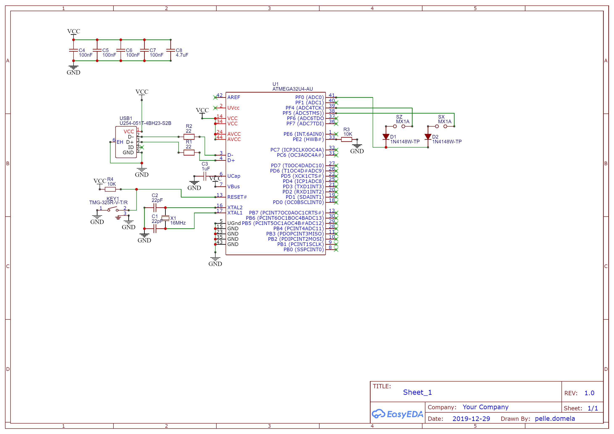
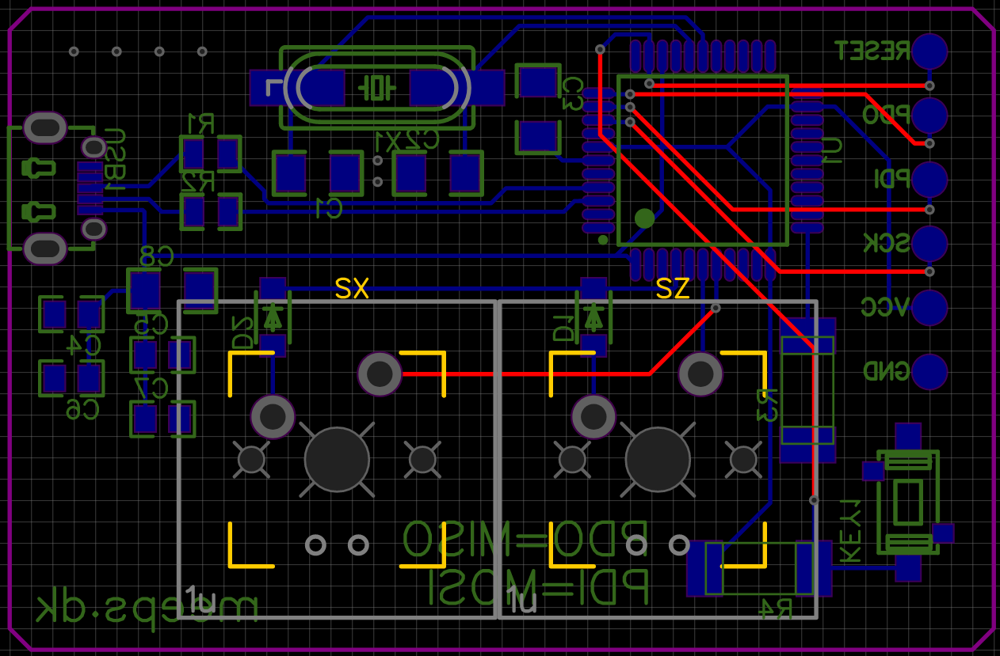
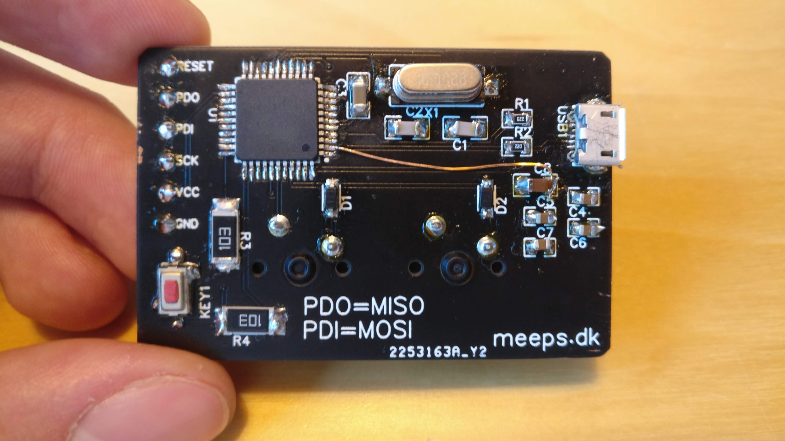
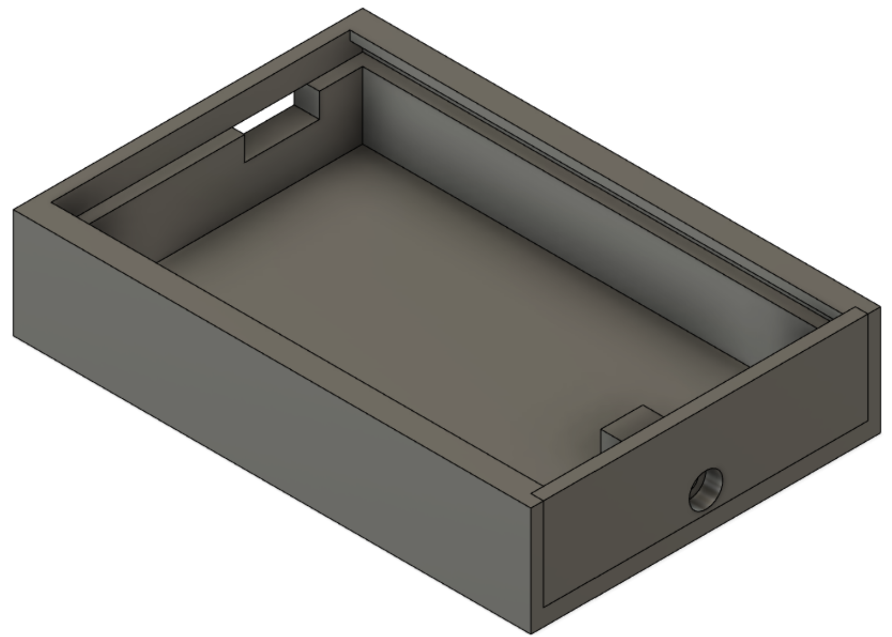
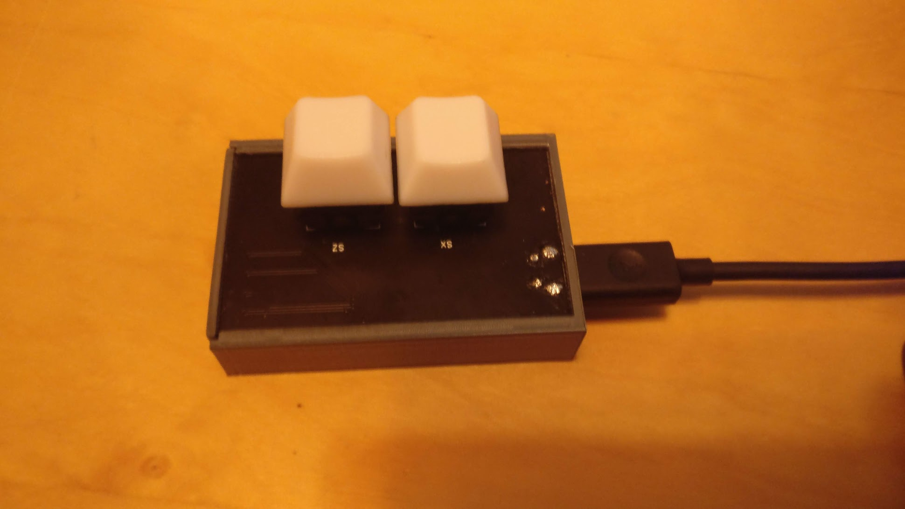
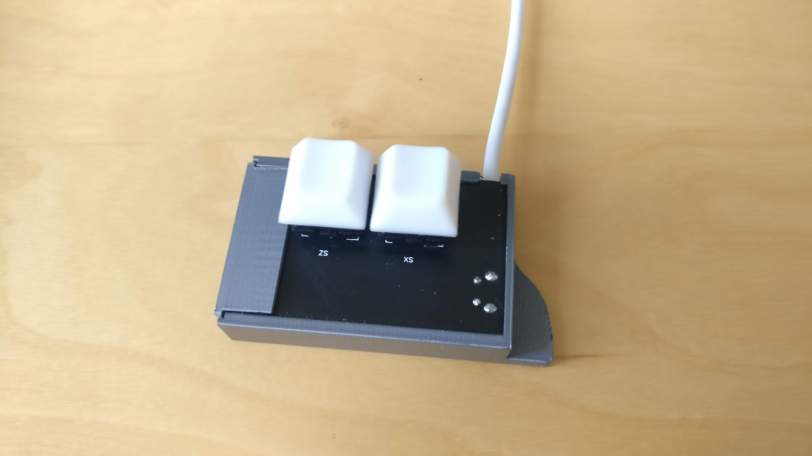

This is my first blog post. I doubt that anyone will ever read it, but if you do, hi there 😃.

I’ve been wanting to make my own PCB for a while, and i finally found a good excuse. I play a rythm game called [osu!](https://osu.ppy.sh/) where you press the Z and X keys to the rythm of a song while tracking various shapes on screen with the mouse. It can get a bit loud with a mechanical keyboard, so i decided to make a secondary keyboard with two silent switches, inspired by keyboards like [this](https://www.amazon.com/HFSECURITY-Keyboard-Android-Backlit-Mechanical/dp/B07DL56Y8S).

Many electronics youtubers are sponsored by PCB manufacturing companies like [JLCPCB](https://web.archive.org/web/20211206213924/https://jlcpcb.com/) and [PCBWay](https://www.pcbway.com/). JLCPCB is nice because it is integrated with it’s sister services EasyEDA and LCSC for circuit design and parts ordering, which is why i chose to use it.

## Design

I had never designed a PCB nor worked directly with a microprocessor before, so i thought it would be wise to follow a guide so i didn’t have to guess stuff. I still missed a thing which caused some trouble, but i’ll get to that later. I followed [this guide](https://github.com/ruiqimao/keyboard-pcb-guide) on GitHub, but used EasyEDA instead of KiCad. It is also how i decided on the microcontroller to use, the Atmega32u4. All of the components on LCSC has footprints and symbols that you can use in EasyEDA, so chosing parts was as easy as searching for it on LCSC, and copying the part number into EasyEDA. I specifically chose the capacitors and resistors to be a bit large, so they would be easier to solder. After some hours of designing and layouting i ended up with this design, see if you can spot the mistake:




You can download the gerber files [here](Gerber_OSU-PCB_2021-01-30.zip), but I wouldn’t recommend anyone to build it.


I ordered the PCB and most of the electronic parts from JLCPCB and LCSC. The PCB’s cost 8.8USD (PCB’s because the minimum quanitity was 5), and the parts were 11.12USD.
I ordered the Cherry MX Silent Red switches and some keycaps from [KBDfans](https://kbdfans.com/) which was 15.5USD.
The total was 35.42USD, including shipping. Not too bad, but the switches are expensive.

## Assembly

Soldering the parts onto the PCB probably took the longest time for this project. I bought some solder flux and a new solderwick, got out the soldering station and began soldering. I started with the microprocessor, using the SMD soldering technique described by GreatScott! in the YouTube video below. I had some trouble, but got the hang of it.



The component that gave me the most trouble with soldering was probably the USB Micro B connector, which has tiny pins half tucked in under the main connector and the legs going through the circuit board were too short, so soldering them properly in place was difficult. I ended up ripping two pads of, thankfully none that were needed. The finished PCB ended up looking like this:



Ignore the unsightly jumper wire for now, we will get to it 😅.

## Plugging it in

Moment of truth, would Windows recognize it? You’ve probably guessed the answer. No. The only reaction was a warning about excessive power draw on a USB port. Oh no.

## Debugging

I checked with my multimeter and an old oscilloscope barely capable of displaying the 16Mhz signal, to check that all the voltages were right and that the clock was running. Everything was correct... very weird. The crystal won’t oscillate with just a voltage applied, the microprocessor generates a feedback signal to keep it going, so at least some part of it had to be working.

While i was soldering the microcontroller i applied quite a bit of heat for some time while removing the solder blobs, i thought that might have destroyed the chip, and maybe some of the pins were shorted causing the power draw. That is why i went on Ebay and ordered a new microcontroller for 12.55USD which increased the total cost to 47.97USD.

After using the soldering iron to bend each of the legs away from their pad, and only ripping one off (thankfully not an important one either), i soldered the new chip on, one leg at a time, making sure to let it cool in between.

Moment of truth again, would i work? Aaaaaaaand, no…

The default firmware on the chip is supposed to show up via USB, so you can program the chip via the connection, but i thought that maybe something was wrong. Therefore i configured my Arduino UNO as an ISP programmer and connected it to the the pads on the PCB that i had had the foresight to make (the silver circles on the left of the PCB). I uploaded the custom firmware, which I’ll get to later. It went great, no errors. I also fiddled a bit with the e-fuses of the chip, which are some bits you can set to configure the chip to use the correct clock speed, oscillator, etc. Nothing seemed to be wrong with the chip itself, but it still wouldn’t show up in Windows. The USB connection must be the issue.

I got the _brilliant_ idea of looking at the schematic to see if i had missed something, which i should have just done in the first place. I noticed that the UVcc pin was not connected to anything. It is supposed to be connected to the reference voltage for the USB port, which in my circuit is the same as Vcc.

After soldering in a jumper wire between UVcc and Vcc, i connected the circuit to my PC, and everything just worked. Brilliant. I’m dumb.

## Firmware

The firmware I used is an open source keyboard firmware called Quantum Mechanical Keyboard which you can configure to match your pins on the microcontroller and the button layout. You can find the configuration files for my keyboard in the github repository, should you want to build one yourself (again, don’t recommend it), or need an example (though there are probably better examples out there).

The configuration is really easy, the QMK repo has a script to make a new keyboard config (what you see in the repository). Then you pretty much just need to edit 4 files, [keyboard_name].h, config.h, keymap.h and rules.mk

[keyboard_name].h looks like this:

```cpp
// meeps_osu.h

#define LAYOUT( \
    k00, k01 \
) \
{ \
    { k00, k01 } \
}
```

This file contains the button layout (the k00 and k01 at the top), and how the switch matrix is wired (the ones at the bottom). See the QMK Hand wiring guide under “Creating and compiling your firmware locally (command line method)” for more detail and how to do this yourself.

config.h looks like this:

```cpp
/* USB Device descriptor parameter */
#define VENDOR_ID 0xFEED
#define PRODUCT_ID 0x0000
#define DEVICE_VER 0x0001
#define MANUFACTURER Meep
#define PRODUCT osu_keyboard
#define DESCRIPTION A custom osu keyboard

/* key matrix size */
#define MATRIX_ROWS 1
#define MATRIX_COLS 2

/*
 * Keyboard Matrix Assignments
 *
 * Change this to how you wired your keyboard
 * COLS: AVR pins used for columns, left to right
 * ROWS: AVR pins used for rows, top to bottom
 * DIODE_DIRECTION: COL2ROW = COL = Anode (+), ROW = Cathode (-, marked on diode)
 *                  ROW2COL = ROW = Anode (+), COL = Cathode (-, marked on diode)
 *
 */
#define MATRIX_ROW_PINS { F0 }
#define MATRIX_COL_PINS { F4, F5 }
#define UNUSED_PINS

/* COL2ROW, ROW2COL*/
#define DIODE_DIRECTION COL2ROW
```

This file contains the product information, information on how you connected the pins on the MCU and how the diodes are wired. You can see that my matrix columns are wired to pins F4 and F5, and my one row is wired to F0. You can configure many more things in here, but these are the most important.

keymap.c looks like this:

```cpp
const uint16_t PROGMEM keymaps[][MATRIX_ROWS][MATRIX_COLS] = {
    /* Base */
    [0] = LAYOUT(
        KC_Z,    KC_X
    )
};
```

This file contains the actual commands the buttons are mapped to, like the Z or X buttons which are used for osu! or perhaps an ESC or CTRL key.

rules.mk looks like this

```makefile
# MCU name
MCU = atmega32u4

# Bootloader selection
#   Teensy       halfkay
#   Pro Micro    caterina
#   Atmel DFU    atmel-dfu
#   LUFA DFU     lufa-dfu
#   QMK DFU      qmk-dfu
#   ATmega32A    bootloadHID
#   ATmega328P   USBasp
BOOTLOADER = atmel-dfu
```

This file contains information on what MCU you are using, and what bootloader it has.

After editing these files it’s as simple as typing `make meeps_osu:meeps`. This will compile the firmware for the meeps_osu keyboard using keymap meeps.

You can download the compiled firmware .hex file from the releases page of the github repository. Should you want to build it yourself, follow the steps in the “build enironment setup” link in the bottom of README.md. Then copy the osu-kb repo folder into the keyboards folder of the QMK repository and type the command above.

### Flashing

I did the flashing using avrdude and an Arduino UNO as an ISP programmer as mentioned before. This should just work via USB with QMK’s programmer software QMK Toolbox.

## Case

The case was designed in Fusion 360 and 3D printed on a Prusa i3 MK3. You can download a zip with the `.f3d` and `.stl` files [here](osu-case-files.zip). This is how it looks:



After printing, the PCB is slid in, and the end cap is screwed in place using an M3 screw. The fit was a bit tight, so i sanded it down a bit. You can modify the f3d file to fit your needs. The case has some indents for flet or silicone pads underneath to dampen the sounds, but i havent gotten around to adding them yet, so right now the keyboard is just lying on a silicone mat.

## Conclusion

This whole project has been really fun, and i have learned a lot about designing PCB’s. I would like to think that i would have an easier time in the future, now that i know to make sure that parts have long enough legs, to place decoupling capacitors close to the chips and to review my design the day after designing it at 3am, but i guess new challenges and problems will always come up.

The finished thing looks like this:



The USB ports placement is not optimal, which is something else i will take with me for future projects. But even with all these faults, it still feels like an overall well finished project, and I am kind of proud of it.

I would not recommend that you build this keyboard, as I said it has many issues and . Definitely try designing and building one yourself though, just avoid the mistakes I made here!

## Fin

This post was originally made on an older version of my site in January 2020. I’ve since made some changes to the keyboard, which now looks like this:



The case has been modified with an improved retention mechanism and a thumb rest. The USB connector wasn’t working and was causing the keyboard to disconnect randomly, so it was replaced with a sacrificed USB cable soldered directly to the PCB. I also 3D printed some custom key-caps to fit the theme better. Lastly, it has been stuck to the table with double-sided tape.
